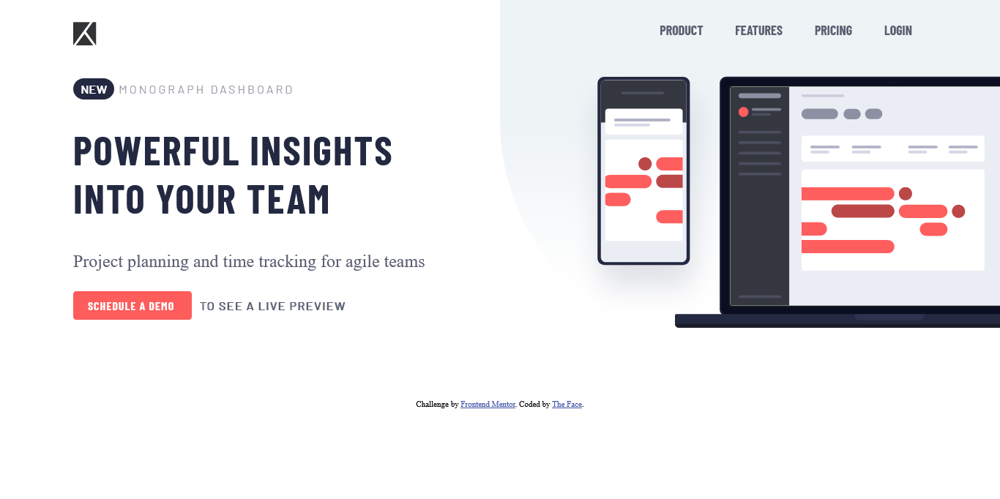

# Frontend Mentor - Project tracking intro component solution

This is my solution to the [Project tracking intro component challenge on Frontend Mentor](https://www.frontendmentor.io/challenges/project-tracking-intro-component-5d289097500fcb331a67d80e).

### Screenshot

### Links

- Solution URL: [Check solution](https://www.frontendmentor.io/solutions/project-tracking-intro-component-lUAAEpDDUh)
- Live Site URL: [Visit live site](https://thefacetracking.vercel.app)

### Built with

- Semantic HTML5 markup
- CSS custom properties
- JavaScript

## Author

- Website - [Ezekiel The Face](https://thefaceportfolio.netlify.app)
- Frontend Mentor - [@iamtheface](https://www.frontendmentor.io/profile/iamtheface)
- Twitter - [@thefacetweets](https://www.twitter.com/thefacetweets)
